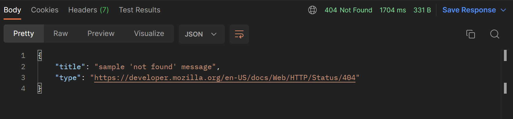
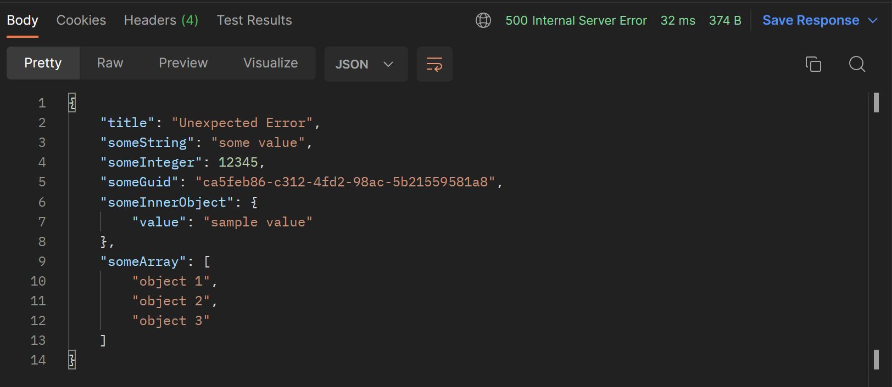

# General

This library defines `ApiExceptions` that you can throw in your .Net applications.

# Use with Asp.Net Core

> 💡
> You can always refer to [this](https://github.com/BitzArt/ApiExceptions/tree/main/sample/BitzArt.ApiExceptions.AspNetCore.Sample) sample project for guidance.

## Setup:

Add the nuget package:

```
dotnet add package BitzArt.ApiExceptions.AspNetCore
```

Add this line to your `Program.cs` when configuring services:
```csharp
builder.Services.AddApiExceptionHandler();
```

Add this line to your `Program.cs` when configuring the request pipeline:
```csharp
// This line should go before any other middleware that might throw exceptions
app.UseApiExceptionHandler();
```

## Usage:
Then, anywhere in your code, you can throw exceptions like:
```csharp
throw ApiException.NotFound("sample 'not found' message");
```
This will generate an http response with appropriate status code:



 ## Extra:
You can also add any custom fields:



These responses follow [RFC7807: Problem Details](https://www.rfc-editor.org/rfc/rfc7807) standard.

# Use outside of Asp.Net Core

To use `ApiExceptions` in your applications, add this nuget package to your project:

```
dotnet add package BitzArt.ApiExceptions
```

This will allow you to use ApiExceptions, and you can then handle them as you see fit.
